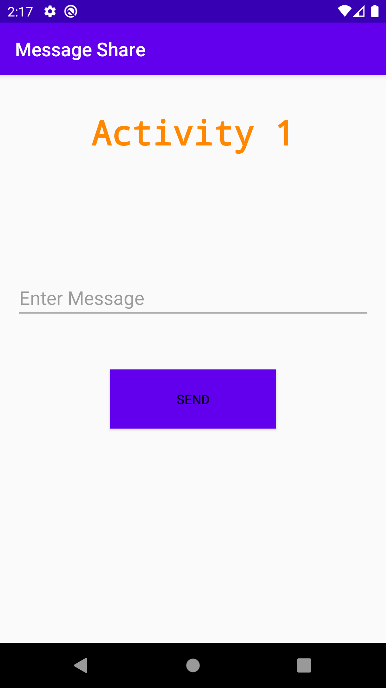
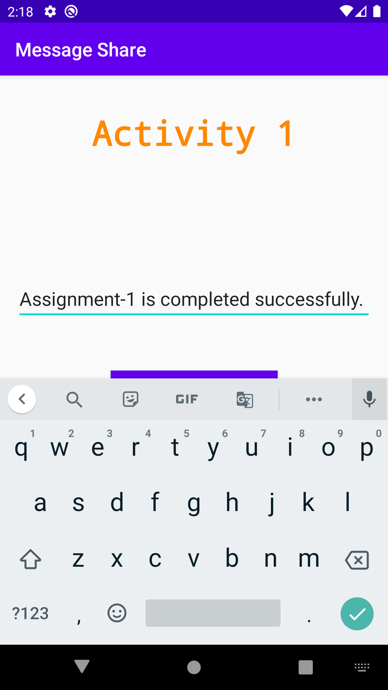
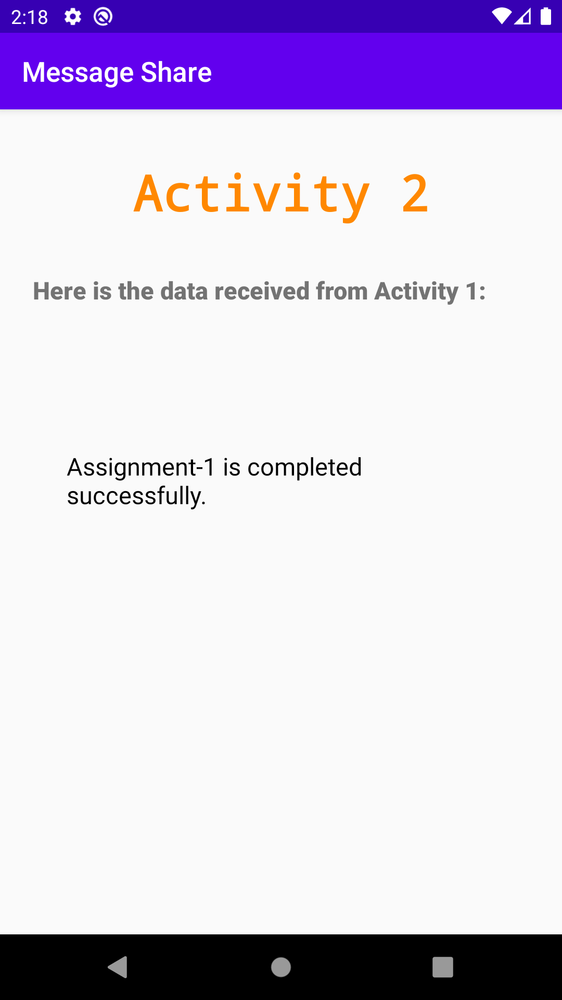

#  Android-Mobile-Programming 
👷🏻‍♂️ ***Build your first app: Send/Pass data from one activity to another.*** 🛠

## Project Structure ⚙
```
src
├───androidTest
│	└───java
│		└───transferdata
│			└───ExampleInstrumentedTest
├───main
│	└───java
│		└───transferdata
│			├───MainActivity
│			└───SecondActivity
├───res
├───drawable
├───layout
└───values
```
<details>
  <summary><strong> Initial Activity-1 👨🏻‍💻 : </strong></summary>
  <p align="center">
    
  </p>
</details>
<details>
  <summary><strong> Activity-1 with entered data 📃 : </strong></summary>
  <p align="center">
    
  </p>
</details>
<details>
  <summary><strong> Activity-2 (Displaying entered data) 🖨 : </strong></summary>
  <p align="center">
    
  </p>
</details>
